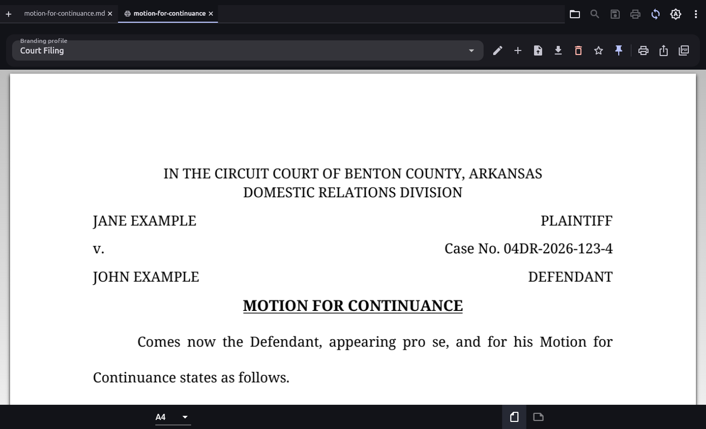
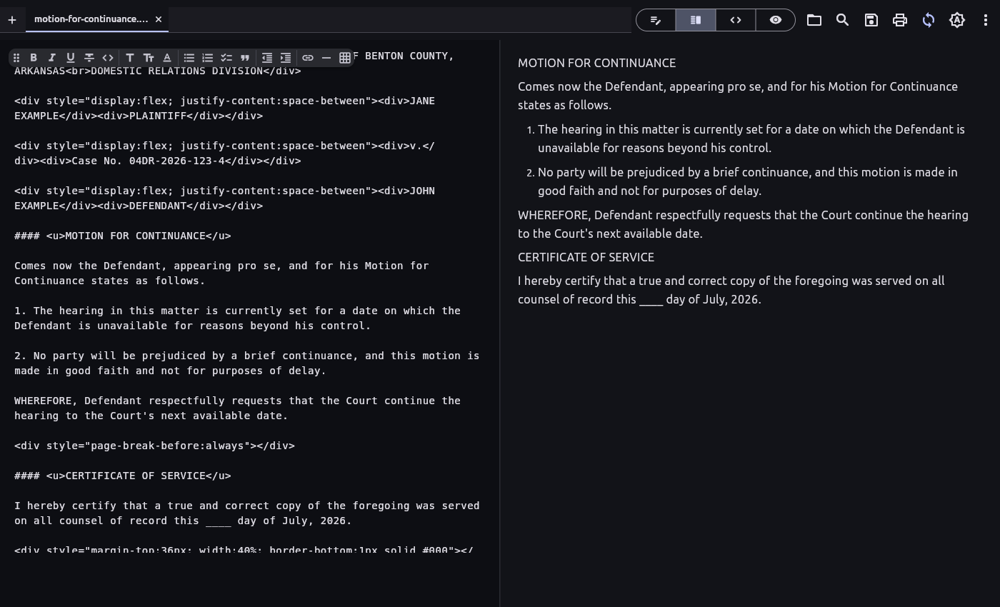

# Markdown Studio

[](https://venmo.com/u/thesaltykorean)
[](https://github.com/TheSaltyKorean/md/releases/latest)
[](https://thesaltykorean.github.io/md/)

Write in Markdown, publish polished PDFs — including court-ready filings.
A cross-platform viewer + Notion-style WYSIWYG editor for **Windows, Linux,
Android, iOS and macOS**, built with Flutter.

**Draft with AI, file with confidence.** AI assistants read and write
Markdown fluently; Markdown Studio is the polish-and-print step — pick a
profile and the same plain-text draft comes out as a branded report or a
court-compliant pleading (12pt, double-spaced, justified, captions,
certificate of service).

<p align="center">
  
</p>
<p align="center"><em>A plain-Markdown motion rendered with the built-in
Court Filing profile — centered court header, margin-to-margin caption,
double-spaced justified body. Source + result:
<a href="docs/samples/motion-for-continuance.md">motion-for-continuance.md</a>
→ <a href="docs/samples/motion-for-continuance.pdf">PDF</a>.</em></p>

<p align="center">
  
</p>
<p align="center"><em>Split view — raw Markdown (with the floating format
toolbar) beside the live preview. Printing opens in its own tab, so you can
keep editing.</em></p>

## Download

| Platform | Get it |
| --- | --- |
| **Windows** | [MSI installer](https://github.com/TheSaltyKorean/md/releases/latest/download/markdown-studio-windows-x64.msi) · [setup.exe](https://github.com/TheSaltyKorean/md/releases/latest/download/markdown-studio-windows-x64-setup.exe) · [portable zip](https://github.com/TheSaltyKorean/md/releases/latest/download/markdown-studio-windows-x64-portable.zip) |
| **Linux** | [.deb package](https://github.com/TheSaltyKorean/md/releases/latest/download/markdown-studio-linux-amd64.deb) · [portable tar.gz](https://github.com/TheSaltyKorean/md/releases/latest/download/markdown-studio-linux-x64-portable.tar.gz) |
| **Android** | [APK](https://github.com/TheSaltyKorean/md/releases/latest/download/markdown-studio-android.apk) (signed) |
| **macOS** | [app zip](https://github.com/TheSaltyKorean/md/releases/latest/download/markdown-studio-macos.zip) (unsigned — right-click → Open) |
| **iOS** | [unsigned IPA](https://github.com/TheSaltyKorean/md/releases/latest/download/markdown-studio-ios-unsigned.ipa) (sideload via AltStore/Sideloadly) |

Installers set everything up (Start Menu / desktop entry / file association);
portable builds just extract and run. Step-by-step install notes ship with
[every release](https://github.com/TheSaltyKorean/md/releases/latest).

## Highlights

- **Four view modes** — Notion-style WYSIWYG **Edit**, **Split**
  source + live preview, **Raw** source, read-only **Preview**.
- **Editor comforts** — multi-document tabs (drag to reorder or tear off),
  find & replace (Ctrl/Cmd+F/H), floating format toolbar, drag & drop,
  auto-reload of external changes, light/dark/system themes.
- **Print & PDF studio** — per-document **branding profiles** (fonts,
  colours, logo, headers/footers, watermarks) in a print-preview tab;
  profiles are plain JSON an AI assistant can generate.
- **Court-filing mode** — uniform 12pt, double-spaced, justified,
  first-line indents, monochrome; text flows continuously across pages.
- **Forms & filings in Markdown** — fill-in blanks, signature lines,
  two-column captions, and forced page breaks via a small inline-HTML
  subset.

## Documentation

- [Print & branding profiles](docs/print-profiles.md) — templates, fields,
  worked examples.
- [AI profile authoring](docs/ai-profile-authoring.md) — have an assistant
  generate a template.
- [Fill-in lines & inline HTML in PDFs](docs/pdf-inline-html.md) — blanks,
  signatures, page breaks.
- [Development guide](docs/DEVELOPMENT.md) — toolchain, project layout,
  building from source.
- [Releasing](docs/RELEASING.md) — cutting releases, signing, store
  submission.
- [CLAUDE.md](CLAUDE.md) — contributor working rules.

## Building from source

```bash
# Flutter is pinned to 3.41.9 (see .fvmrc) — 3.44+ does not compile yet.
fvm install && fvm flutter pub get
fvm flutter run -d linux        # or windows / macos / a device
```

Details, platform prerequisites and the full project layout:
[docs/DEVELOPMENT.md](docs/DEVELOPMENT.md).

## License

[PolyForm Noncommercial 1.0.0](LICENSE.md) — free for personal,
research and other non-commercial use; commercial use requires separate
terms.
